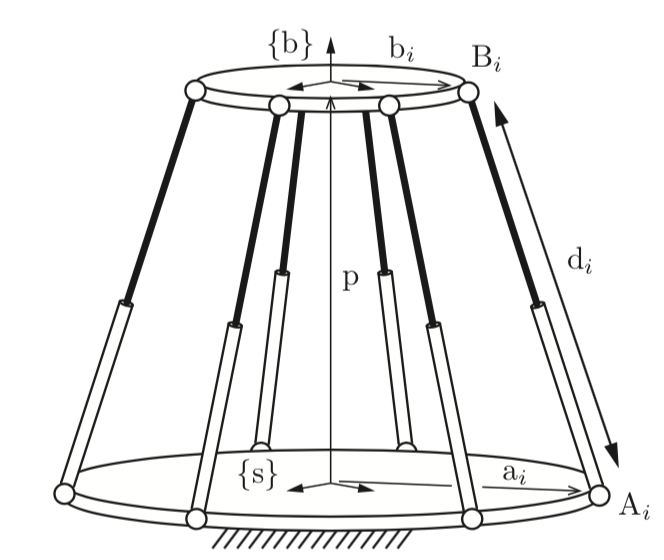

<button type="button" onclick="window.location.href='index.html';">Homepage</button>
<button type="button" onclick="window.location.href='ch6.html';">Previous</button>
<button type="button" onclick="window.location.href='ch8.html';">Next</button>

## Introduction

> Any kinematic chain that contains one or more loops is called a **closed chain**.

> ... **parallel mechanisms**: closed chains consisting of fixed and moving platforms connected by a set of "legs". The legs themselves are typically open chains but sometimes can also be other closed chains.

Here are several notes about closed chains:
* Not all joints in closed chains are actuated, these passive joints make kinematic analysis of closed chains more complicated than open chains.
* Joint variables in closed chains "must satisfy a number of loop closure constraint equations, which may or may not be independent depending on the configuration of the mechanism". This feature introduces the mechanism named redundantly actuated.

A comparision between open-chain robot and parallel robot is given below:

| open-chain robot | parallel robot |
| --- | --- |
| all joints actuated | some joints unactuated |
| large workspace | small workspace |
| weak, flexible | strong, stiff |
| FK straightforward | FK tricky |
| IK tricky | IK(often) straightforward |

Given the complexity of configurations of closed chains, "oftentimes the analysis of these robots is based on symmetries and insight into the specific structure of the mechanism". Thus, this chapter is example-based.

## 3$\times$RPR Planar Parallel Mechanism

For this mechanism, only the forward and inverse kinematics are analyzed. The analysis of inverse kinematics can be easily solved by simple geometry. For forward kinematics, after some algebraic manipulation, the problem can be considered as finding solutions for a single polynomial, behind which is the idea of reducing the complexity of equations exploiting certain features of the mechanism.

Another similar mechanism, the 3$\times$RRR mechanism, is introduced at *Exercise 7.3* in the textbook.

## Stewart-Gouph Platform

### Forward and Inverse Kinematics

This platform is a 6$\times$SPS mechanism, only the six middle prismatic joints are actuated. Similar with the previous example, the inverse kinematics is straightforward using simple geometry knowledge. Again, when meeting forward kinematics problem, the equations can be complicated and hard to solve. In this case, we need to solve 12 unknowns with 12 equations.

### Differential Kinematics

In principle, we can directly differentiate forward kinematics to get:

$$
\dot{s} = G(R, p)\mathcal{V}_s
$$

where $s$ indicates lengths of the prismatic joints, $\mathcal{V}_s$ is the spatial twist of the end-effector, and $G(R,p)$ is the Jacobian of inverse kinematics. But this method usually require considerable algebraic manipulation.

An alternative way is "based on the conversation of power principle used to determine the static relationship $\tau = J^T\mathcal{F}$, which is applicable for both open and closed chains. With this method, the Jacobian matrix can be obtained directly.

## General Parallel Mechanisms

### Forward and Inverse Kinematics

For forward kinematics, we have:

$$
\left\{
	\begin{array}{ll}
		T_1(\theta) = T_2(\phi) \\
		T_2(\phi) = T_3(\psi)
	\end{array}
\right.
$$

constrained by $R^TR = I$, we finally have 24 equation in which 12 ones are independent.

Based on these 12 independent equations, the DoF of the mechanism can be calculated as:

$$
DoF = \textit{Amount of joints} - 12
$$

thus, when the number of actuated joints is equal to the DoF, which is named exactly actuated, we can solve the joint values of all the rest passive joints, then calculate the configuration of the end-effector. That's how the forward kinematics is solved here.

As for inverse kinematics, given a desired end-effector configuration $T$, we can solve this equation to get joints variables $(\theta, \phi, \psi)$:

$$
\left\{
	\begin{array}{ll}
		T_1(\theta) = T \\
		T_2(\phi) = T \\
		T_3(\psi) = T
	\end{array}
\right.
$$

### Differential Kinematics

The kinematic loop constraints we derived in the last section must be satisfied at all times:

$$
\left\{
	\begin{array}{ll}
		T_1(\theta) = T_2(\phi) \\
		T_2(\phi) = T_3(\psi)
	\end{array}
\right.
$$

thus, we can write them in another form:

$$
\left\{
	\begin{array}{ll}
		\dot{T_1}T_1^{-1} = \dot{T_2}T_2^{-1} \\
		\dot{T_2}T_2^{-1} = \dot{T_3}T_3^{-1} 
	\end{array}
\right.
$$

where we already know $\dot{T}_iT_i^{-1} = [\mathcal{V}_i]$, and $\mathcal{V}_i = J_i(\theta)\dot{\theta}$. Thus, we have another form of the equations:

$$
\left\{
	\begin{array}{ll}
		J_1(\theta)\dot{\theta} = J_2(\phi)\dot{\phi} \\
		J_2(\phi)\dot{\phi} = J_3(\psi)\dot{\psi} 
	\end{array}
\right.
$$

which can be rearranged as:

$$
\left[\begin{matrix} J_1(\theta) & -J_2(\phi) & 0 \\ 0 & -J_2(\phi) & J_3(\psi) \end{matrix}\right] \left[\begin{matrix} \dot{\theta} \\ \dot{\phi} \\ \dot{\psi} \end{matrix}\right] = 0
$$

Assuming without loss of generality only three joints, $q_a = [\theta_1, \phi_1, \psi_1]^T$, are actuated, we have:

$$
\left[\begin{matrix} \dot{\theta} \\ \dot{\phi} \\ \dot{\psi} \end{matrix}\right] = \left[\begin{matrix} \dot{q}_a \\ \dot{q}_p \end{matrix}\right] \in \mathbb{R}^{15}
$$

where $\dot{q}_a\in\mathbb{R}^{3}$ and $\dot{q}_p\in\mathbb{R}^{12}$. We also have:

$$
\left[\begin{matrix} J_1(\theta) & -J_2(\phi) & 0 \\ 0 & -J_2(\phi) & J_3(\psi) \end{matrix}\right] = \left[\begin{matrix} H_a(q) & H_p(q) \end{matrix}\right] \in \mathbb{R}^{12\times 15}
$$

where $H_a \in \mathbb{R}^{12\times 3}$ and $H_p \in \mathbb{R}^{12\times 12}$. Thus, based on the equations:

$$
\left[\begin{matrix} H_a(q) & H_p(q) \end{matrix}\right] \left[\begin{matrix} \dot{q}_a \\ \dot{q}_p \end{matrix}\right] = 0
$$

and assume $H_p$ is invertible, we can calculate all passive joint velocities from given actuated joint velocities:

$$
\dot{q}_p = -H_p^{-1}H_a\dot{q}_a
$$

In this way, we can calculate the end-effector's twist.

However, this method is not concise enough. **It would much better if there exists an equation like $\mathcal{V}_s = J_a(q)\dot{q}_a$, where $J_a(q)\in\mathbb{R}^{6\times 3}$, that directly link actuated joint velocities to end-effector twist**.

For each of the open chains in the mechanism, for example the chain 1, we have differential kinematics $J_1(\theta)\dot{\theta} = \mathcal{V}_s$. Here $\dot{\theta}$ includes both actuated and passive joints, so it's natural to think about calculating all passive joint velocities in chain 1 with $q_a$. To achieve this goal, let's relook the equation $\dot{q}_p = -H_p^{-1}H_a\dot{q}_a$. The $i$-th element in $\dot{q}_p$ is the dot product of $\dot{q}_a$ and the $i$-th row of $-H_p^{-1}H_a$. So, each row of $-H_p^{-1}H_a$ can projects actuated joint velocities to a related passive joint velocity.

Based on the conclusion above, assuming chain 1 has 5 joints with only the first actuated, we have:

$$
\left[\begin{matrix} \dot{\theta}_2 \\ \dot{\theta}_3 \\ \dot{\theta}_4 \\ \dot{\theta}_5 \end{matrix}\right] = \left[\begin{matrix} g_2^T \\ g_3^T \\ g_4^T \\ g_5^T \end{matrix}\right] \dot{q}_a
$$

where $g_i^T$ is the relative row of $-H_p^{-1}H_a$ to each passive joint in chain 1. Thus, we can finally derive a form of Jacobian matrix that can directly projects actuated joint velocities to end-effector twist:

$$
\mathcal{V}_s = J_1(\theta) \left[\begin{matrix} e_1^T \\ g_2^T \\ g_3^T \\ g_4^T \\ g_5^T \end{matrix}\right] \left[\begin{matrix} \dot{\theta}_1 \\ \dot{\phi}_1 \\ \dot{\psi}_1 \end{matrix}\right] = J_a(q) \dot{q}_a
$$

where $e_1^T = \left[\begin{matrix} 1 & 0 & 0 \end{matrix}\right]$. This conclusion also holds for rest of the legs.

## Singularities

> On the basis of these examples we classify closed-chain singularities into three basic types: **actuator singularities**, **configuration space singularities**, and **end-effector singularities**.

For actuator singularities and configuration space singularities, we can use the equation derived previously:

$$
H(q)\dot{q} = \left[\begin{matrix} H_a(q) & H_P(q) \end{matrix}\right] \left[\begin{matrix} \dot{q}_a \\ \dot{q}_p \end{matrix}\right]
$$

If rank $H_p(q) < p$ then $q$ is an actuator singularity, in which case $H_p$ is not invertible and we can not derive passive joint velocities directly from actuated joint velocities. This can be further divided into **degenerate** and **nondegenerate** singularities, which involves additional mathmetical subtleties.

If rank $H(q) < p$ then $q$ is a configuration space singularity. Note this also means actuator singularity.

Details about end-effector singularity and example of these three singularities can found in the *Section 7.3* of the textbook.

***

<button type="button" onclick="window.location.href='#top';">Back To Top</button>

