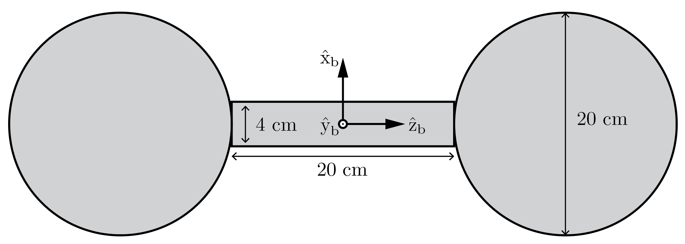

<button type="button" onclick="window.location.href='index.html';">Homepage</button>
<button type="button" onclick="window.location.href='ch7.html';">Previous</button>
<button type="button" onclick="alert('This is the last chapter!')">Next</button>

## Introduction

The topic of this chapter is **robot dynamics**, which discusses the relation between joint accelerations $\ddot{\theta}$ and joint forces and torques $\tau$ with given joint positions $\theta$ and joint velocities $\dot{\theta}$. This relation is usually described by a set of equations named **dynamic equations / equations of motion**:

$$
\begin{align}
\tau &= M(\theta)\ddot{\theta} + h(\theta, \dot{\theta}) \tag*{(for inverse dynamics)}
\end{align}
$$

$$
\begin{align}
\ddot{\theta} &= M^{-1}(\theta) (\tau - h(\theta, \dot{\theta}))  \tag*{(for forward dynamics)}
\end{align}
$$

Typically, there are two ways to derive these equations, one is **Newton-Euler formulation**, another is **Lagrangian dynamics formulation**. We will start with the latter one.

## Lagrangian Formulation

### Euler-Lagrangian Equations

In the Lagrangian formulation of dynamics, the system's configuration is described in a set of **generalized coordinates** $$q \in \mathbb{R}^n$$, in which the **generalized forces** are defined as $$f \in \mathbb{R}^n$$. For example, for a rigid body in a $\hat{x}$-$\hat{y}$ plane, the generalized coordinates could be either $(x, y) \in \mathbb{R}^2$ or $(\theta_1, \theta_2) \in \mathbb{R}^2$, then both the configuration and the force are represented in this set of coordinates. As mentioned in Chapter 5, the power generated by the joints is can represented as $$\tau^T\dot{\theta}$$, here we have $f\dot{q}$ representing the power, where $q$ represents the generalized coordinates.

Recall that the purpose of robot dynamics is to connect joint accrelerations and joint forces and torques. Here, they're connected by the **Lagrangian function** $$\mathcal{L}(q, \dot{q})$$ for a mechanical system, which is defined as:

$$
\mathcal{L}(q, \dot{q}) = \mathcal{K}(q, \dot{q}) - \mathcal{P}(q)
$$

where $\mathcal{K}$ is the overall system's kinetic energy and $\mathcal{P}$ is the potential energy.

Then we can calculate the force $f$ using the **Euler-Lagrangian equations with external forces**:

$$
f = \frac{d}{dt} \frac{\partial\mathcal{L}}{\partial\dot{q}} - \frac{\partial\mathcal{L}}{\partial q}
$$

Thus, the key issue in Lagrangian dynamics formulation is to derive $\mathcal{K}$ and $\mathcal{P}$ to get the $\mathcal{L}$.

From an example of 2R planar robot(*Figure 8.1* in textbook), we can see a general representation of Euler-Lagrangian equations for serial chains containing revolute joints:

$$
\tau = M(\theta)\ddot{\theta} + \underbrace{c(\theta, \dot{\theta}) + g(\theta)}_{h(\theta, \dot{\theta})}
$$

where $\theta \in \mathbb{R}^n$ is the configuration of the serial chain, $M(\theta) \in \mathbb{R}^{n\times n}$ is the symmetric, positive definite **mass matrix** that is only related to $\theta$, $c(\theta, \dot{\theta})$ is the velocity product term that is composed of terms with $\theta_i^2$ or $\theta_i\theta_j$, and $g(\theta)$ is the gravity term.

### Understanding Velocity Product Term
 
Velocity product term can be further divided into two categories: terms with $\theta_i \theta_j$ are **Colioris** terms, and terms with $\theta_i^2$ are **centripetal** terms. These two terms exist because the coordinates $(\theta_1, \theta_2)$ are not in an inertial frame. The textbook has a good example explaining the centripetal acceleration and coriolis acceleration(*Figure 8.2*).

In a more general case of rigid-link robots, the joint forces and torques can be represented explicitly as:

$$
\tau_i = \sum_{j=1}^n m_{ij}(\theta)\ddot{\theta}_j + \sum_{j=1}^n \sum_{k=1}^n \Gamma_{ijk}(\theta)\dot{\theta}_j\dot{\theta}_k + \frac{\partial\mathcal{P}}{\partial\theta_i} , \qquad i = 1,\cdots,n,
$$

where $m_{ij}$ is the $(i,j)$th element of the $n\times n$ mass matrix, $\Gamma_{ijk}(\theta)$ is named **Christoffel symbols of the first kind**, which is derived from the mass matrix as:

$$
\Gamma_{ijk}(\theta) = \frac{1}{2} (\frac{\partial m_{ij}}{\partial \theta_k} + \frac{\partial m_{ik}}{\partial \theta_j} - \frac{\partial m_{jk}}{\partial \theta_i}),
$$

all these symbols combined together forms an $n\times n\times n$ matrix $\Gamma$, and with this matrix the equations of motion can be written as:

$$
\tau = M(\theta)\ddot{\theta} + \dot{\theta}^T\Gamma(\theta)\dot{\theta} + g(\theta),
$$

we notice that $\dot{\theta}^T\Gamma(\theta)\dot{\theta}$ can be interpreted as:

$$
\dot{\theta}^T\Gamma(\theta)\dot{\theta} = \left[\begin{matrix} \dot{\theta}\Gamma_1(\theta)\dot{\theta} \\ \dot{\theta}\Gamma_2(\theta)\dot{\theta} \\ \vdots \\ \dot{\theta}\Gamma_n(\theta)\dot{\theta} \end{matrix}\right],
$$

where $\Gamma_i(\theta)$ is an $n\times n$ matrix with $(j, k)$th entry $\Gamma_{ijk}$. This representation not only emphasizes the fact that velocity product term can be written explicitly as a quadratic in joint velocity vector.

From another point of view, we usually can represent a scalar momentum $p = \mathfrak{m}\dot{x}$, where $\mathfrak{m}$ is the mass and $\dot{x}$ is a scalar velocity, and the force applying on the mass is the time derivative of the momentum. However, in some cases the mass is not a constant but a function of configuration, which itself is funtion of time $t$, then we can write the momentum as $p = \mathfrak{m}(x(t))\dot{x}$. In this case, the force applying on the mass is:

$$
\begin{aligned}
f =& \frac{dp}{dt} \\
  =& \mathfrak{m}\ddot{x} + \frac{\partial \mathfrak{m}}{\partial x} \dot{x}\dot{x} , 
\end{aligned}
$$

where $\dfrac{\partial \mathfrak{m}}{\partial x}$ plays the same role as the Christoffel symbols of a mass matrix.

### Understanding Mass Matrix

For a point mass with mass $m$ and velocity $v$, its kinetic energy is $\frac{1}{2}v^Tmv$. Similarly, for an open chain, we have its kinetic energy represented in form of mass matrix and joint velocities as $\frac{1}{2} \dot{\theta}^T M(\theta) \dot{\theta}$. However, for a point mass, its acceleration is always parallel to the force applied on that based on the equation $f=m \ddot{x}$, while joint acceleration $\ddot{\theta}$ is not generally a scalar multiple of $\tau$ even when the robot is at rest, for the mass matrix $M(\theta)$ presents different effective mass in different acceleration directions. **This is one of the most important features we need to notice about mass matrix.**

Generally, we can visualize the mass matrix by mapping a unit ball of joint accelerations $$\{\ddot{\theta} \mid \ddot{\theta}^T\ddot{\theta}=1\}$$ to a joint force-torque ellipsoid, but this visualization is not intuitive enough for people do not sense joint forces and torques in most times. Alternatively, a better solution is to visualize the "apparent end-effector mass" by mapping a unit ball of end-effector accelerations to the forces applied as the end-effector, thus people can sense the force by grabbing the end-point of the robot.

There is one thing worth noting. When introducing "manipulability ellipsoid" in Chapter 5, we mapped a unit ball of joint velocities, which is defined by $\dot{\theta}^T\dot{\theta} = \dot{q}^T (JJ^T)^{-1} \dot{q} = 1$, to an ellipsoid of end-effector velocities. The direction of the principle axes of the ellipsoid are aligned with the eigenvectors of $A=JJ^T$ and the lengths of the axes are the square root of the eigenvalues of $A$. However, when visualizing both mass matrix and apparent end-effector mass matrix, the lengths of the principle axes are the eigenvalues of $M$ and $\Lambda$, and the textbook didn't tell why.

[TODO: Explanation]

## Dynamics of a Single Rigid Body

For dynamicsof a single rigid body, we want to know how to express the wrench $\mathcal{F}$ with given twist $\mathcal{V}$. To make this problem easier, we first divide $\mathcal{F}$ into its two components: force $f$ and torque $m$, and find out how to express them with linear velocity $v$ and angular velocity $\omega$. 

### Classical Formulation {#classical_formulation}

Before we start, we need to know that in Newton-Euler dynamics, a rigid body is considered as consisting by a number of rigidly connected point masses. Based on this, we introduce the concept of **center of mass** as the point at mass-weighted/density-weighted centroid of the body. The definition and several properties of center of mass can help to simplify the problems later.

After setting the center of mass, we can describe force $f$ and torque $m$ of *a single point mass* in the forms of linear velocity $\nu$ and angular velocity $\omega$ with help of the second derivative of the point mass' position $p(x)$ w.r.t. time:

$$
\ddot{p}_i = \dot{v}_b + [\dot{\omega}_b]r_i + [\omega_b]\nu_b + [\omega_b]^2r_i ,
$$

where $r_i$ is the initial position of the point mass. Then we can describe force $f$ and torque $m$ of that point mass in the body frame:

$$
f_i = \mathfrak{m}_i (\dot{\mathcal{v}}_b + [\dot{\omega}_b]r_i + [\omega_b]\nu_b + [\omega_b]^2r_i) \quad , \\

m_i = [r_i]f_i
$$

After that, we can describe the force and wrench of the whole rigid body by summing each point mass up:

$$
\begin{aligned}
f_b = & \sum_i f_i \\ 
    = & \mathfrak{m}(\dot{\nu}_b + [\omega_b]\nu_b) \quad , \\

m_b = & \sum_i m_i \\
    = & (-\sum_i \mathfrak{m}_i [r_i]^2) \dot{\omega}_b + [\omega_b] (-\sum_i \mathfrak{m}_i [r_i]^2) \omega_b \\
    = & \mathcal{I}_b \dot{\omega}_b + [\omega_b] \mathcal{I}_b \omega_b
\end{aligned}
$$

where we introduce the symmetric, definite-positive **rotational inertia matrix** $\mathcal{I}_b=-\sum_i\mathfrak{m}_i[r_i]^2 \in \mathbb{R}^{3\times 3}$, and we have **Euler's equation for a rotating rigid body** as:

$$
m_b = \mathcal{I}_b\dot{\omega}_b + [\omega_b]\mathcal{I}_b\omega_b.
$$

With the rotational inertia matrix, we can write the rotational kinetic energy in form similar with the case of mass matrix:

$$
\mathcal{K} = \frac{1}{2} \omega_b^T\mathcal{I}_b\omega_b.
$$

Since the rotational inertia matrix is symmetric, we only need six parameters to represent it. The **principal axes of inertia** are aligned with the directions of the eigenvectors of the rotational inertia matrix and the **principal moments of inertia**, which are the scalar moments of inertia about these axes, are equal to the eigenvalues of the matrix. When the axes of $\{b\}$ are aligned with the principle axes of inertia, the equations of motion can be further simplified.

By its definition, calculating rotational inertia matrix requires volume integral(or triple integral), which could be tedious for objects with irregular shapes. For rigid bodies consisting of component rigid bodies, especially when those components are connected through joints, the two equations below could be helpful.

The first equation is to calculate the inertia matrix which is represented in another frame $\{c\}$ that is rotated from $\{b\}$:

$$
\mathcal{I}_c = R_{bc}^T\mathcal{I}_bR_{bc}
$$

When the inertia matrix is represented in another frame $\{q\}$ that is align with $\{b\}$ but at a point $q=(q_x,q_y,q_z)$, we have **Steiner's theorem** states that:

$$
\mathcal{I}_q = \mathcal{I}_b + \mathfrak{m}(q^TqI - qqT)
$$

According to the textbook:

> Steiner's theorem is a more general statement of the parallel-axis theorem, which states that the scalar inertia $$\mathcal{I}_{d}$$ about an axis parallel to, but a distance $d$ from, an axis through the center of mass is related to the scalar inertia $\mathcal{I}_{cm}$ about the axis through the center of mass by:
> 
> $$\mathcal{I}_d = \mathcal{I}_{cm} + \mathfrak{m}d^2$$ . 

Here one thing worth mentioning is that parallel-axis theorem is for *scalar inertia*. [Quiz question 1](#quiz_solution) is a good example of exploiting Steiner's theorem or parallel-axis theorem.

### Twist-Wrench Formulation

Now we try to represent the body wrench $\mathcal{F}_b$ by body twist $\mathcal{V}_b$:

$$
\begin{aligned}
\left[\begin{matrix} m_b \\ f_b \end{matrix}\right] & = \left[\begin{matrix} \mathcal{I}_b & 0 \\ 0 & \mathfrak{m}I \end{matrix}\right] \left[\begin{matrix} \dot{\omega}_b \\ \dot{\nu}_b \end{matrix}\right] - \left[\begin{matrix} [\omega_b] & 0 \\ [\nu_b] & [\omega_b] \end{matrix}\right]^T \left[\begin{matrix} \mathcal{I}_b & 0 \\ 0 & \mathfrak{m}I \end{matrix}\right] \left[\begin{matrix} \omega_b \\ \nu_b \end{matrix}\right] \\
                                                    & = \mathcal{G}_b \dot{\mathcal{V}}_b -  \left[\begin{matrix} [\omega_b] & 0 \\ [\nu_b] & [\omega_b] \end{matrix}\right]^T \mathcal{G}_b \mathcal{V}_b \\
                                                    & = \mathcal{G}_b\dot{\mathcal{V}}_b - [\text{ad}_{\mathcal{V}_b}]^T \mathcal{G}_b \mathcal{V}_b
\end{aligned}
$$

Then we look at the elements in this equation. First, $$\mathcal{G}_b = \left[\begin{matrix} \mathcal{I}_b & 0 \\ 0 & \mathfrak{m}I \end{matrix}\right] \in \mathbb{R}^{6\times6}$$ is named **spatial inertia matrix**. With this matrix, the kinetic energy can be represented as:

$$
\text{kinetic energy} = \frac{1}{2} \omega_b^T \mathcal{I}_b \omega_b + \frac{1}{2} \mathfrak{m} \nu_b^T \nu_b = \frac{1}{2} \mathcal{V}_b^T \mathcal{G}_b \mathcal{V}_b , 
$$

and the **spatial momentum** $\mathcal{P}_b \in \mathbb{R}^6$ is defined as:

$$
\mathcal{P}_b = \left[\begin{matrix} \mathcal{I}_b\omega_b \\ \mathfrak{m}\nu_b \end{matrix}\right] = \mathcal{G}_b \mathcal{V}_b . 
$$

$[\text{ad}_{\mathcal{V}_b}]^T \mathcal{G}_b \mathcal{V}_b$ is named the **Lie bracket** of $\mathcal{V}_b$ and $\mathcal{G}_b\mathcal{V}_b$. The Lie bracket of two twists $\mathcal{V}_1$ and $\mathcal{V}_2$ are defined as:

$$
[\text{ad}_{\mathcal{V}_1}]\mathcal{V}_2 = \text{ad}_{\mathcal{V}_1}(\mathcal{V}_2) = \left[\begin{matrix} [\omega_1] & 0 \\ [\nu_1] & [\omega_1] \end{matrix}\right] \left[\begin{matrix} \omega_2 \\ \nu_2 \end{matrix}\right] \in \mathbb{R}^6 ,
$$

where

$$
[\text{ad}_{\mathcal{V}}] = \left[\begin{matrix} [\omega] & 0 \\ [\nu] & [\omega] \end{matrix}\right] .
$$

Finally, we have the **dynamic equations for a single rigid body** as:

$$
\mathcal{F}_b = \mathcal{G}_b\dot{\mathcal{V}}_b - [\text{ad}_{\mathcal{V}_b}]^T\mathcal{G}_b\mathcal{V}_b .
$$

Describing the dynamic equations in another frame $\{a\}$ is easy. First, we derive the spatial inertia matrix in $\{a\}$:

$$
\mathcal{G}_a = [\text{Ad}_{T_{ba}}]^T \mathcal{G}_b [\text{Ad}_{T_{ba}}]
$$

Then, the dynamic equations can be written in the same form(actually the form of the equations of motion are independent of the frame of representation):

$$
\mathcal{F}_a = \mathcal{G}_a \dot{\mathcal{V}}_a - [\text{ad}_{\mathcal{V}_a}]^T \mathcal{G}_a \mathcal{V}_a.
$$

## Newton-Euler Inverse Dynamics

***

## Solution for Course Quiz: Part I {#quiz_solution}

**Question 1**: 

> Consider a iron dumbbell consisting of a cylinder connecting two solid spheres at either end of the cylinder. The density of the dumbbell is 5600 $kg/m^3$. The cylinder has a diameter of 4 $cm$ and a length of 20 $cm$. Each sphere has a diameter of 20 $cm$. Find the approximate rotational inertia matrix $\mathcal{I}_b$ in a frame {b} at the center of mass with z-axis aligned with the length of the dumbbell. Your entries should be written in units of $kg/m^2$, and the maximum allowable error for any matrix entry is 0.01, so give enough decimal places where necessary.

Well, for those who are really good at volume integral(or triple integral), they can try to integral the result directly. However, for people who are not so good at integral like me, a better idea is to calculate the roational inertial matrix of each component of the dumbbell in term of frame at its individual center of mass first, then exploit **Steiner's theorem** to express each inertia matrix in a "common" frame and sum them up to get the final inertia matrix.

One thing worth mentioning here is the dimension of $q$ in Steiner's theorem, which indicates the relative position of the current frame with respect to $\{b\}$, matters. In this question, $q$ must be a $3\times1$ matrix to get the correct answer.

[TODO: Exploiting Steiner's theorem can also get the correct answer]

~~~python
import math
import numpy as np
import modern_robotics as mr

pi = math.pi

print("\n------ Question 1 ------")

density = 5600
rad_cyl = 0.02
len_cyl = 0.2
rad_sph = 0.1

mass_cyl = density * pi * len_cyl * rad_cyl**2
print("\nMass of Cylinder: ", mass_cyl, sep='')
Ixx_cyl = mass_cyl * (3 * rad_cyl**2 + len_cyl**2) / 12
Iyy_cyl = Ixx_cyl
Izz_cyl = mass_cyl * rad_cyl**2 / 2
RIMatrix_cyl = np.diag([Ixx_cyl, Iyy_cyl, Izz_cyl])
print("\nRIMatrix_cyl:\n", np.array2string(RIMatrix_cyl, separator=','), sep='')

mass_sph = density * 4/3 * pi * rad_sph**3
print("\nMass of Sphere: ", mass_sph, sep='')
Ixx_sph = mass_sph * 2/5 * rad_sph**2
Iyy_sph = Ixx_sph
Izz_sph = Ixx_sph
RIMatrix_sph = np.diag([Ixx_sph, Iyy_sph, Izz_sph])
print("\nRIMatrix_sph:\n", np.array2string(RIMatrix_sph, separator=','), sep='')

'''exploit Steiner's theorem'''
q1 = np.array([[0], [0], [rad_sph + len_cyl/2]])
RIMatrix_sph1 = RIMatrix_sph + mass_sph * (np.dot(q1.T, q1) * np.eye(3) - np.dot(q1, q1.T))
q2 = np.array([[0], [0], [-rad_sph - len_cyl/2]])
RIMatrix_sph2 = RIMatrix_sph + mass_sph * (np.dot(q2.T, q2) * np.eye(3) - np.dot(q2, q2.T))
print("\nRIMatrix_sph1:\n", np.array2string(RIMatrix_sph1, separator=','), sep='')
print("\nRIMatrix_sph2:\n", np.array2string(RIMatrix_sph2, separator=','), sep='')

RIMatrix_q1 = RIMatrix_cyl + RIMatrix_sph1 + RIMatrix_sph2
RIMatrix_q1_off = np.around(RIMatrix_q1, decimals=2)
print("\nQuestion 1:\n", np.array2string(RIMatrix_q1_off, separator=','), sep='')
~~~

***

<button type="button" onclick="window.location.href='#top';">Back To Top</button>

